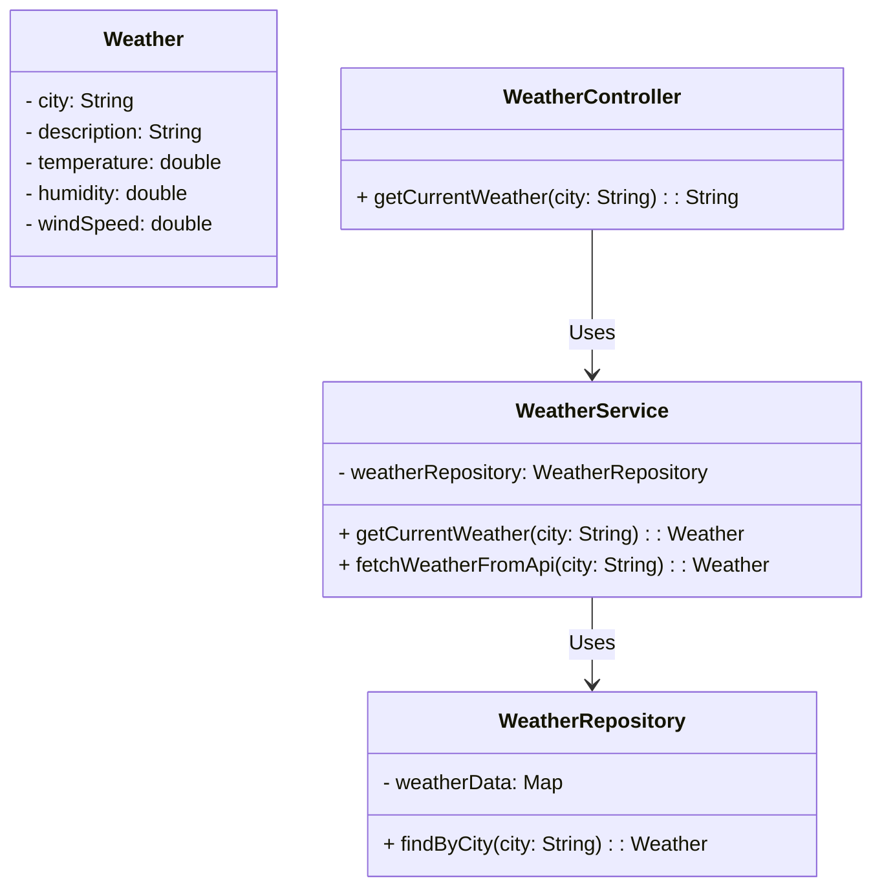

# API de Previsão do Tempo

Esta é uma API simples para obter a previsão do tempo atual de uma determinada cidade.

## Funcionalidades

- **Obter Previsão do Tempo Atual por Cidade**: Endpoint para obter a previsão do tempo atual de uma cidade específica.

## Como Usar

### Obter Previsão do Tempo Atual por Cidade

- **Endpoint**: `/api/weather/current`
- **Método HTTP**: `GET`
- **Parâmetros**:
  - `city` (obrigatório): Nome da cidade para a qual deseja obter a previsão do tempo.

Exemplo de solicitação: GET /api/weather/current?city=New%20York

Exemplo de resposta:

```json
{
  "city": "New York",
  "description": "Clear sky",
  "temperature": 25.0,
  "humidity": 40.0,
  "windSpeed": 10.0
}
```
# Diagrama de Classes



# Tecnologias Utilizadas
- **Java**
- **Spring Boot**
- **Maven**

